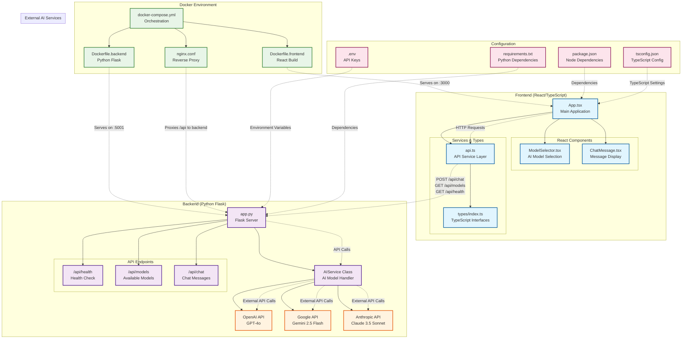

# 🏗️ MultiGenQA Architecture Documentation

## Overview
MultiGenQA is a multi-AI chat platform that allows users to interact with different AI models (OpenAI GPT-4o, Google Gemini, and Claude) through a unified interface. The application follows a modern web architecture with React/TypeScript frontend and Python Flask backend.

## Architecture Diagram



## Component Breakdown

### 🎨 Frontend (React/TypeScript)
- **Port**: 3000 (development), 80 (Docker)
- **Technology**: React 18, TypeScript, Axios
- **Key Files**:
  - `App.tsx` - Main application component with chat logic
  - `ModelSelector.tsx` - Dropdown for selecting AI models
  - `ChatMessage.tsx` - Individual message display component
  - `api.ts` - API service layer for backend communication
  - `types/index.ts` - TypeScript interfaces and types

### 🐍 Backend (Python Flask)
- **Port**: 5001
- **Technology**: Flask, OpenAI SDK, Google AI SDK, Anthropic SDK
- **Key Features**:
  - RESTful API with 3 main endpoints
  - Unified interface for multiple AI services
  - Error handling and logging
  - CORS enabled for frontend communication

### 🤖 AI Services Integration
- **OpenAI GPT-4o**: Latest OpenAI model for general conversations
- **Google Gemini 2.5 Flash**: Google's multimodal AI model
- **Claude 3.5 Sonnet**: Anthropic's helpful and harmless AI

### 🐳 Docker Environment
- **Multi-stage build** for optimized production images
- **nginx** as reverse proxy for frontend
- **Docker Compose** orchestrates both services
- **Health checks** ensure services are running properly

## Data Flow

### 1. User Interaction Flow
```
User Input → React App → API Service → Flask Backend → AI Service → External AI API
```

### 2. Response Flow
```
AI Response → Flask Backend → API Service → React App → User Interface
```

### 3. Docker Request Flow
```
Browser → nginx (port 3000) → React App
Browser → nginx (/api/*) → Flask Backend (port 5001)
```

## API Endpoints

| Endpoint | Method | Purpose | Response |
|----------|--------|---------|----------|
| `/api/health` | GET | Check if backend is running | `{"status": "healthy"}` |
| `/api/models` | GET | Get available AI models | `{"models": [...]}` |
| `/api/chat` | POST | Send chat message | `{"response": "...", "model": "..."}` |

## Environment Setup

### Development Mode
1. **Backend**: `python backend/app.py` (port 5001)
2. **Frontend**: `npm start` (port 3000)
3. **API Communication**: Direct HTTP calls to localhost:5001

### Production Mode (Docker)
1. **Frontend**: nginx serves React build (port 3000)
2. **Backend**: Flask app in container (port 5001)
3. **API Communication**: nginx proxies `/api/*` to backend

## Configuration Files

### TypeScript Configuration
- `tsconfig.json` - TypeScript compiler settings
- `package.json` - Node.js dependencies and scripts

### Python Configuration
- `requirements.txt` - Python dependencies
- `backend/.env` - API keys and environment variables

### Docker Configuration
- `docker-compose.yml` - Service orchestration
- `Dockerfile.frontend` - React app containerization
- `Dockerfile.backend` - Flask app containerization
- `nginx.conf` - Web server and proxy configuration

## Security Considerations

1. **API Keys**: Stored in environment variables, never committed to git
2. **CORS**: Properly configured for frontend-backend communication
3. **Docker**: Isolated environments with minimal attack surface
4. **nginx**: Acts as reverse proxy, hiding backend implementation

## Development Workflow

1. **Local Development**: Use helper scripts (`start-backend.py`, `start-frontend.sh`)
2. **Docker Development**: Use `docker-compose up --build`
3. **Production**: Same Docker setup with environment-specific configurations

## Scalability Considerations

- **Stateless Design**: No session storage, easy to scale horizontally
- **API Gateway**: nginx can be extended for load balancing
- **Microservices Ready**: Backend can be split into separate AI service containers
- **CDN Ready**: Frontend build can be served from CDN

## Monitoring & Health Checks

- **Backend Health**: `/api/health` endpoint
- **Docker Health**: Built-in health checks in docker-compose
- **Logging**: Comprehensive logging in Flask backend
- **Error Handling**: Graceful error handling with user-friendly messages

## Future Enhancements

1. **Database Integration**: Add conversation history persistence
2. **Authentication**: User accounts and API key management
3. **Rate Limiting**: Prevent API abuse
4. **Caching**: Redis for response caching
5. **WebSocket**: Real-time streaming responses
6. **Monitoring**: Prometheus/Grafana for metrics